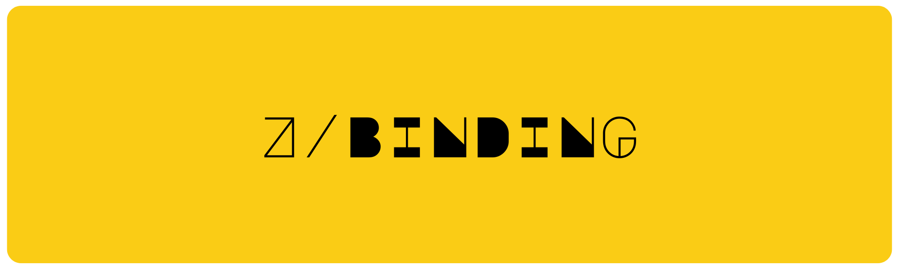

### 🍿 Binding



### 🥳 Try Now

```go
go get github.com/ziqorg/binding
```

### 🫰 Features

1. ⛏️ Minimal Package, 4KB
2. 👉 JSONPath Getter & Setter with [bytedance/sonic](https://github.com/bytedance/sonic)
3. ❤️ Ast Condition Evaluation / Expression Parser with [expr-lang/expr](https://github.com/expr-lang/expr)

### 🤩 Feel The Magic

#### Getter & Setter

```go
x := binding.NewBinding(`{"key1": {"nested_1": 1}}`)
x.Get("key1.nested_1") // (1, nil)

x.Set("key1.nested_1", true)
x.Get("key1.nested_1") // (true, nil)
```

#### Evaluate

See: [expr-lang/language-definition](https://expr-lang.org/docs/language-definition)

```go
x := binding.NewBinding(`{"key1": {"nested_1": [1, 2, true]}}`)
x.Get("key1.nested_1") // ([1, 2, true], nil)

x.Set("key1.nested_1", true) // dynamic type changer
x.Set("key2.keyinner1.keyinner3", "ggwp") // optional chaining upsertion
x.Set("key2.keyinner1.keyinner4", []int{1, 2})

x.Evaluate("!key1.nested_1 && key2.keyinner1.keyinner3 == 'ggwp'") // false
x.Evaluate("max(key2.keyinner1.keyinner4[0], key2.keyinner1.keyinner4[1]) == 2") // true
```
